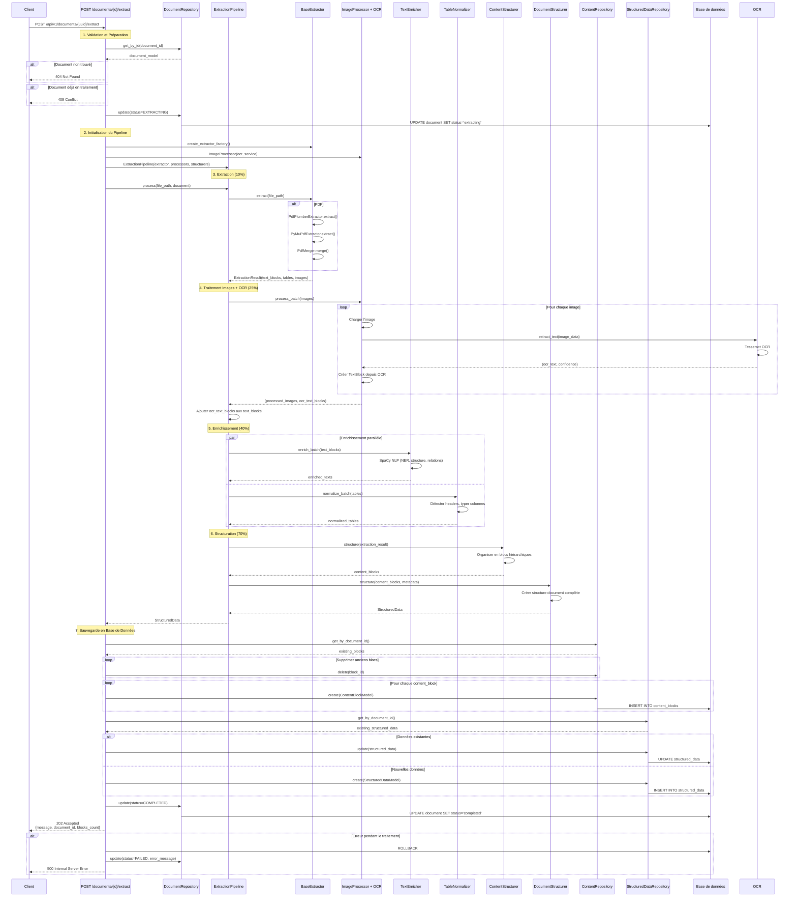
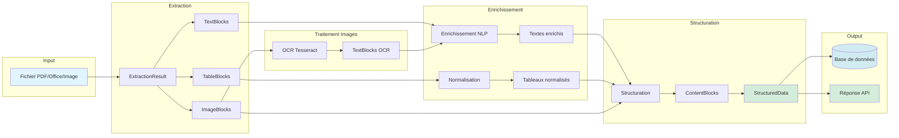

# Schéma Fonctionnel de l'Endpoint Extract

## Diagramme de Séquence



## Diagramme de Flux Fonctionnel

```mermaid
flowchart TD
    Start([Client: POST /documents/{id}/extract]) --> Validate{Document existe?}
    
    Validate -->|Non| Error404[404 Not Found]
    Validate -->|Oui| CheckStatus{Status = EXTRACTING?}
    
    CheckStatus -->|Oui| Error409[409 Conflict]
    CheckStatus -->|Non| UpdateStatus[Update status = EXTRACTING]
    
    UpdateStatus --> InitPipeline[Initialiser Pipeline]
    InitPipeline --> CreateExtractor[Créer Extractor selon type]
    InitPipeline --> CreateProcessors[Créer Processors]
    InitPipeline --> CreateStructurers[Créer Structurers]
    
    CreateExtractor --> Extract[1. Extraction 10%]
    CreateProcessors --> Extract
    CreateStructurers --> Extract
    
    Extract --> ExtractContent{Contenu extrait?}
    ExtractContent -->|Non| ErrorExtract[Erreur: Aucun contenu]
    ExtractContent -->|Oui| ProcessImages[2. Traitement Images + OCR 25%]
    
    ProcessImages --> OCRImages[OCR sur chaque image]
    OCRImages --> CreateOCRText[Créer TextBlocks depuis OCR]
    CreateOCRText --> Enrichment[3. Enrichissement 40%]
    
    Enrichment --> EnrichTexts[Enrichir textes avec SpaCy]
    Enrichment --> NormalizeTables[Normaliser tableaux]
    
    EnrichTexts --> Structure[4. Structuration 70%]
    NormalizeTables --> Structure
    
    Structure --> StructureContent[Structurer contenu en blocs]
    StructureContent --> StructureDocument[Structurer document complet]
    
    StructureDocument --> SaveDB[5. Sauvegarde Base de Données]
    
    SaveDB --> DeleteOldBlocks[Supprimer anciens blocs]
    DeleteOldBlocks --> SaveContentBlocks[Sauvegarder content_blocks]
    SaveContentBlocks --> SaveStructuredData[Sauvegarder structured_data]
    SaveStructuredData --> UpdateCompleted[Update status = COMPLETED]
    
    UpdateCompleted --> Success[202 Accepted<br/>Retourner résultat]
    
    Error404 --> End([Fin])
    Error409 --> End
    ErrorExtract --> Rollback[ROLLBACK DB]
    Rollback --> UpdateFailed[Update status = FAILED]
    UpdateFailed --> Error500[500 Internal Server Error]
    Error500 --> End
    Success --> End
    
    style Start fill:#e1f5ff
    style Success fill:#d4edda
    style Error404 fill:#f8d7da
    style Error409 fill:#f8d7da
    style Error500 fill:#f8d7da
    style Extract fill:#fff3cd
    style ProcessImages fill:#fff3cd
    style Enrichment fill:#fff3cd
    style Structure fill:#fff3cd
    style SaveDB fill:#d1ecf1
```

## Architecture des Composants

```mermaid
graph TB
    subgraph "Endpoint Layer"
        Endpoint[POST /documents/{id}/extract]
    end
    
    subgraph "Application Layer"
        Pipeline[ExtractionPipeline]
    end
    
    subgraph "Infrastructure Layer - Extractors"
        PdfExtractor[PdfExtractor]
        PdfPlumber[PdfPlumberExtractor]
        PyMuPDF[PyMuPdfExtractor]
        ExcelExtractor[ExcelExtractor]
        WordExtractor[WordExtractor]
    end
    
    subgraph "Infrastructure Layer - Processors"
        ImageProcessor[ImageProcessor]
        OCRService[OcrService]
        TextEnricher[TextEnricher]
        TableNormalizer[TableNormalizer]
    end
    
    subgraph "Infrastructure Layer - Structurers"
        ContentStructurer[ContentStructurer]
        DocumentStructurer[DocumentStructurer]
    end
    
    subgraph "Infrastructure Layer - Database"
        DocumentRepo[DocumentRepository]
        ContentRepo[ContentRepository]
        StructuredDataRepo[StructuredDataRepository]
    end
    
    Endpoint --> Pipeline
    Endpoint --> DocumentRepo
    Endpoint --> ContentRepo
    Endpoint --> StructuredDataRepo
    
    Pipeline --> PdfExtractor
    Pipeline --> ImageProcessor
    Pipeline --> TextEnricher
    Pipeline --> TableNormalizer
    Pipeline --> ContentStructurer
    Pipeline --> DocumentStructurer
    
    PdfExtractor --> PdfPlumber
    PdfExtractor --> PyMuPDF
    
    ImageProcessor --> OCRService
    
    ContentStructurer --> ContentRepo
    DocumentStructurer --> StructuredDataRepo
```

## Flux de Données



## Description des Étapes

### 1. Validation et Préparation (0-5%)
- Vérifier l'existence du document
- Vérifier que le document n'est pas déjà en traitement
- Mettre à jour le statut à `EXTRACTING`
- Initialiser les composants du pipeline

### 2. Extraction (5-10%)
- Sélectionner l'extracteur selon le type de fichier
- Extraire le contenu brut :
  - **PDF** : Utilise `PdfPlumberExtractor` (texte, tableaux) + `PyMuPdfExtractor` (texte, images, structure)
  - **Excel** : Utilise `ExcelExtractor`
  - **Word** : Utilise `WordExtractor`
  - **Images** : Utilise `OcrExtractor`
- Fusionner les résultats si plusieurs extracteurs

### 3. Traitement des Images avec OCR (10-25%)
- Pour chaque image extraite :
  - Charger l'image depuis les bytes
  - Appliquer OCR avec Tesseract (si disponible)
  - Extraire le texte de l'image
  - Créer un `TextBlock` avec le texte OCR
- Ajouter les `TextBlock` OCR aux `text_blocks` existants

### 4. Enrichissement (25-40%)
- **Textes** (parallèle) :
  - Enrichir avec SpaCy (NER, détection de structure, relations)
  - Identifier les entités nommées
  - Détecter la structure hiérarchique
- **Tableaux** (parallèle) :
  - Détecter automatiquement les en-têtes
  - Typer les colonnes (texte, nombre, date, booléen)
  - Valider et nettoyer les données

### 5. Structuration (40-70%)
- Organiser le contenu en blocs hiérarchiques
- Créer les relations entre blocs (parent, previous, next)
- Structurer le document complet avec métadonnées

### 6. Sauvegarde (70-100%)
- Supprimer les anciens blocs de contenu
- Sauvegarder chaque bloc de contenu dans `content_blocks`
- Sauvegarder les données structurées dans `structured_data`
- Mettre à jour le statut du document à `COMPLETED`

### 7. Gestion d'Erreurs
- En cas d'erreur : ROLLBACK de la base de données
- Mettre à jour le statut à `FAILED` avec le message d'erreur
- Retourner une erreur HTTP appropriée

## Codes de Réponse

- **202 Accepted** : Extraction lancée avec succès
- **404 Not Found** : Document non trouvé
- **409 Conflict** : Document déjà en cours de traitement
- **500 Internal Server Error** : Erreur lors du traitement

## Données Retournées

```json
{
  "message": "Extraction terminée",
  "document_id": "uuid-du-document",
  "blocks_count": 99
}
```

