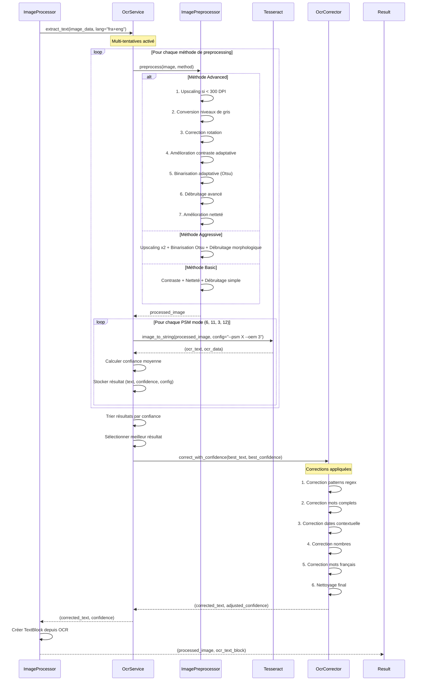
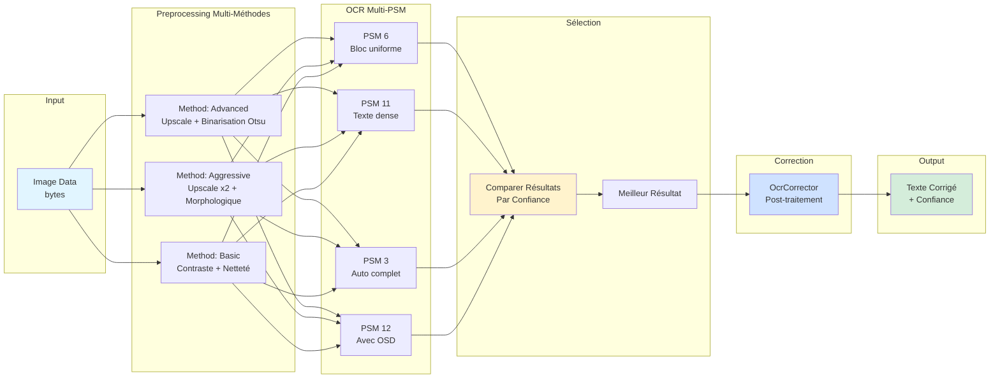
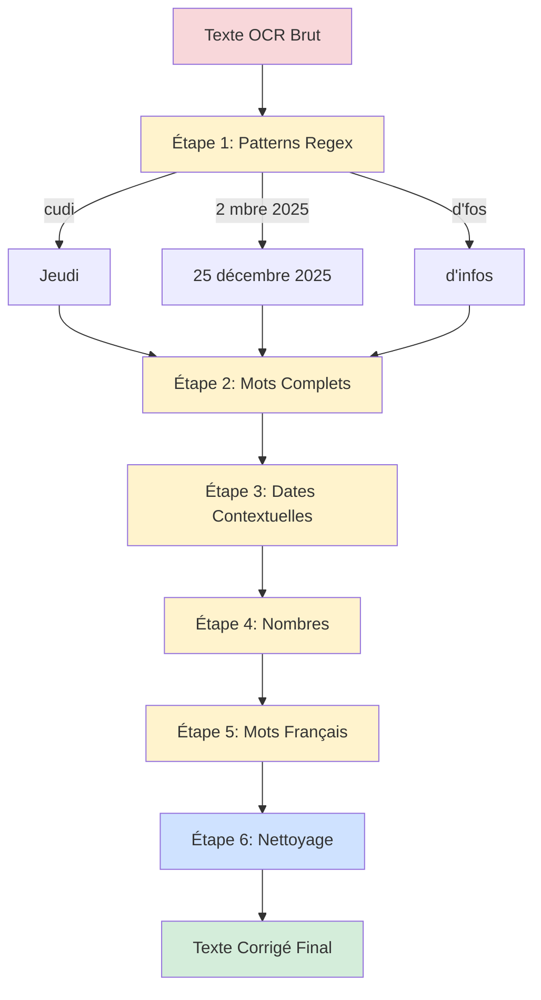
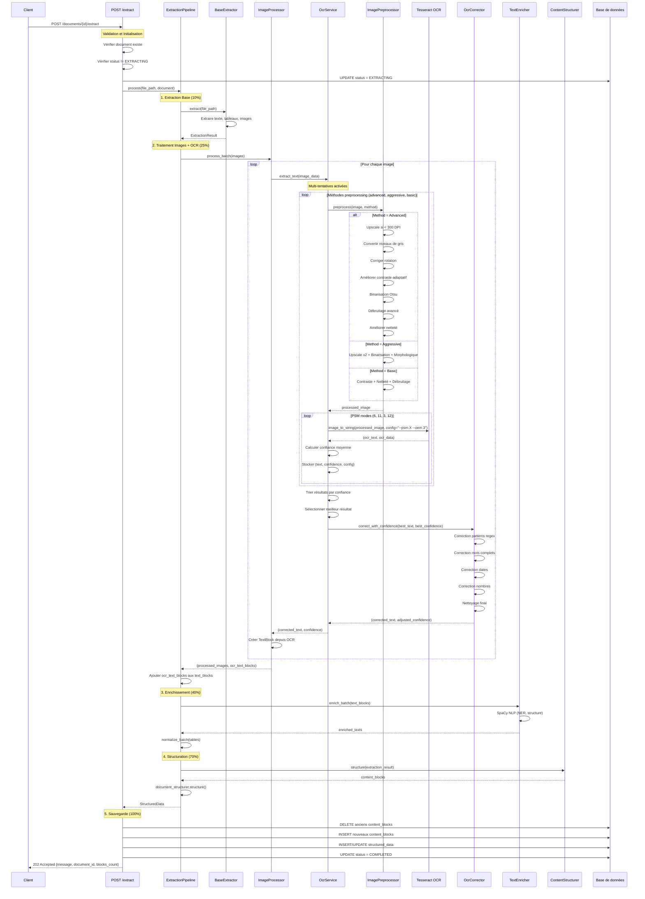

# Schéma de Fonctionnement - Workflow de la Méthode Extract

## Vue d'ensemble du Workflow Complet

```mermaid
flowchart TD
    Start([POST /documents/{id}/extract]) --> Validate{Document existe?}
    
    Validate -->|Non| Error404[404 Not Found]
    Validate -->|Oui| CheckStatus{Status = EXTRACTING?}
    
    CheckStatus -->|Oui| Error409[409 Conflict]
    CheckStatus -->|Non| UpdateStatus[Update status = EXTRACTING]
    
    UpdateStatus --> InitPipeline[Initialiser ExtractionPipeline]
    
    InitPipeline --> Extract[1. Extraction Base<br/>PDF/Office/Images]
    
    Extract --> ExtractResult{Contenu extrait?}
    ExtractResult -->|Non| ErrorExtract[Erreur: Aucun contenu]
    ExtractResult -->|Oui| ProcessImages[2. Traitement Images + OCR Amélioré]
    
    ProcessImages --> OCRWorkflow[Workflow OCR Multi-tentatives]
    
    OCRWorkflow --> PreprocessImages[Preprocessing Avancé<br/>ImagePreprocessor]
    PreprocessImages --> MultiAttempt[Multi-tentatives OCR<br/>Plusieurs PSM modes]
    MultiAttempt --> SelectBest[Sélection Meilleur Résultat]
    SelectBest --> PostCorrect[Correction Post-OCR<br/>OcrCorrector]
    
    PostCorrect --> Enrichment[3. Enrichissement<br/>SpaCy NLP + Normalisation]
    
    Enrichment --> Structure[4. Structuration<br/>Organisation hiérarchique]
    
    Structure --> SaveDB[5. Sauvegarde Base de Données]
    
    SaveDB --> UpdateCompleted[Update status = COMPLETED]
    UpdateCompleted --> Success[202 Accepted<br/>Retour résultat]
    
    Error404 --> End([Fin])
    Error409 --> End
    ErrorExtract --> Rollback[ROLLBACK DB]
    Rollback --> UpdateFailed[Update status = FAILED]
    UpdateFailed --> Error500[500 Internal Server Error]
    Error500 --> End
    Success --> End
    
    style Start fill:#e1f5ff
    style Success fill:#d4edda
    style Error404 fill:#f8d7da
    style Error409 fill:#f8d7da
    style Error500 fill:#f8d7da
    style Extract fill:#fff3cd
    style ProcessImages fill:#fff3cd
    style OCRWorkflow fill:#cfe2ff
    style PreprocessImages fill:#cfe2ff
    style MultiAttempt fill:#cfe2ff
    style PostCorrect fill:#cfe2ff
    style Enrichment fill:#fff3cd
    style Structure fill:#fff3cd
    style SaveDB fill:#d1ecf1
```

## Workflow Détaillé de l'OCR Amélioré



## Architecture des Composants OCR

```mermaid
graph TB
    subgraph "ImageProcessor"
        IP[ImageProcessor.process]
    end
    
    subgraph "OcrService - Service Principal"
        OS[OcrService]
        OS -->|utilise| MultiAttempt[Multi-tentatives]
        OS -->|sélectionne| BestResult[Meilleur Résultat]
    end
    
    subgraph "ImagePreprocessor - Preprocessing"
        IPP[ImagePreprocessor]
        IPP --> Upscale[Upscaling 300 DPI]
        IPP --> Rotate[Correction Rotation]
        IPP --> Contrast[Contraste Adaptatif]
        IPP --> Binarize[Binarisation Otsu]
        IPP --> Denoise[Débruitage Avancé]
        IPP --> Sharpen[Netteté]
    end
    
    subgraph "Tesseract OCR"
        TESS[Tesseract Engine]
        TESS --> PSM6[PSM 6: Bloc uniforme]
        TESS --> PSM11[PSM 11: Texte dense]
        TESS --> PSM3[PSM 3: Auto complet]
        TESS --> PSM12[PSM 12: Avec OSD]
    end
    
    subgraph "OcrCorrector - Post-traitement"
        OC[OcrCorrector]
        OC --> Patterns[Correction Patterns]
        OC --> Words[Correction Mots]
        OC --> Dates[Correction Dates]
        OC --> Numbers[Correction Nombres]
        OC --> Clean[Nettoyage]
    end
    
    IP -->|appelle| OS
    OS -->|utilise| IPP
    OS -->|appelle| TESS
    OS -->|utilise| OC
    
    style OS fill:#cfe2ff
    style IPP fill:#fff3cd
    style TESS fill:#d1ecf1
    style OC fill:#d4edda
```



## Flux de Données Détaillé



## Exemple de Corrections Appliquées



## Détails Techniques des PSM Modes

| PSM Mode | Description | Utilisation |
|----------|-------------|-------------|
| **3** | Segmentation automatique complète (défaut) | Documents variés |
| **6** | Bloc uniforme de texte | Texte en colonne unique |
| **11** | Texte dense | Texte dense sans structure claire |
| **12** | Texte avec OSD | Détection orientation et script |

## Méthodes de Preprocessing

| Méthode | Caractéristiques | Cas d'usage |
|---------|------------------|-------------|
| **Basic** | Contraste + Netteté + Débruitage simple | Images de bonne qualité |
| **Advanced** | Upscaling + Binarisation Otsu + Débruitage avancé | Images normales |
| **Aggressive** | Upscaling x2 + Binarisation Otsu + Morphologique | Images de mauvaise qualité |

## Exemples de Corrections

### Avant → Après

1. **"cudi 2 mbre 2025"** → **"Jeudi 25 décembre 2025"**
   - Correction pattern "cudi" → "Jeudi"
   - Correction date "2 mbre" → "25 décembre"

2. **"plus d'fos"** → **"plus d'infos"**
   - Correction pattern "d'fos" → "d'infos"

3. **"JOURNAL OFFICIEL\nREPUBLIQUE DEMOCRATIQUE DU CONGO"** → **"JOURNAL OFFICIEL\nDE LA\nREPUBLIQUE DEMOCRATIQUE DU CONGO"**
   - Correction contextuelle des mots manquants

## Diagramme de Séquence Complet - Extraction avec OCR



## Performance et Optimisation

- **Multi-tentatives** : Jusqu'à 12 combinaisons testées (3 méthodes × 4 PSM modes)
- **Sélection intelligente** : Choix du meilleur résultat par confiance
- **Correction ciblée** : Corrections spécifiques pour erreurs courantes
- **Fallback** : Si toutes les tentatives échouent, utilisation de la méthode basique
- **Parallélisation** : Traitement des images en batch pour améliorer les performances

